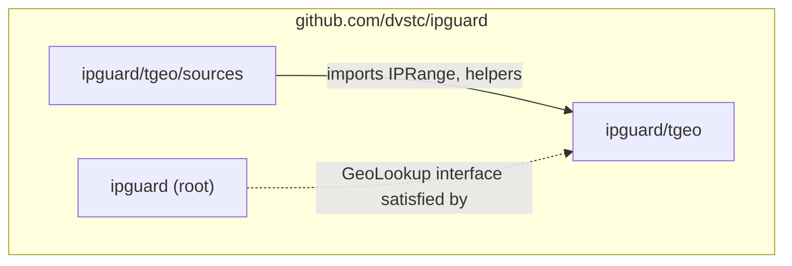

# IPGuard: Design Document

This document captures the design of IPGuard, a reusable Go library for IP filtering with auto-banning, geographic blocking, HTTP middleware with trusted proxy support, PROXY protocol v1/v2 decoding, and the TGEO binary format for IP geolocation. It serves as the authoritative reference for the library's architecture, API surface, and binary format specification.

---

## Table of Contents

1. [Purpose](#purpose)
2. [Architecture](#architecture)
3. [Package Structure](#package-structure)
4. [API Surface](#api-surface)
   - [Root Package (`ipguard`)](#root-package-ipguard)
   - [TGEO Package (`ipguard/tgeo`)](#tgeo-package-ipguardtgeo)
   - [Sources Package (`ipguard/tgeo/sources`)](#sources-package-ipguardtgeosources)
5. [TGEO Binary Format Specification](#tgeo-binary-format-specification)
6. [Evaluation Order](#evaluation-order)
7. [Key Design Decisions](#key-design-decisions)
8. [Dependencies](#dependencies)

---

## Purpose

**IPGuard** provides IP filtering for Go services at multiple layers. Any networked application - HTTP servers, WebSocket endpoints, custom TCP protocols - can use IPGuard to:

1. Whitelist trusted IPs/CIDRs (always allowed, bypasses all other checks)
2. Blacklist known-bad IPs/CIDRs (always blocked)
3. Auto-ban IPs that exceed a failure threshold within a sliding window
4. Block or allow connections by country using GeoIP data
5. Extract real client IPs behind reverse proxies via HTTP headers (X-Forwarded-For, CF-Connecting-IP, etc.)
6. Decode PROXY protocol v1/v2 headers from load balancers to recover real client IPs at the TCP level

IPGuard is not specific to any single product. It can be imported by any Go project that needs IP filtering - reverse proxies, API gateways, update services, game servers, or any system behind load balancers that wants to drop unwanted traffic using the real client IP.

```
                +-------------------+
                |     IPGuard       |
                |  (Go library)     |
                +--------+----------+
                        /|\
                       / | \
                      /  |  \
        +------------+   |   +------------------+
        | api-server |   |   | proxy-service    |
        | (example)  |   |   | (example)        |
        +------------+   |   +------------------+
                         |
                +--------+----------+
                |   Any Go service  |
                |  that accepts     |
                |  TCP connections  |
                +-------------------+
```

---

## Architecture

The library has three packages with a clean dependency graph:



- `tgeo/sources` imports `tgeo` for the `IPRange` type and address helpers
- The root `ipguard` package is fully independent of `tgeo` - it defines a `GeoLookup` interface that `tgeo.Table` happens to satisfy, but any implementation works
- No circular dependencies, no non-stdlib imports

---

## Package Structure

```
github.com/dvstc/ipguard/
├── go.mod
├── config.go          # Config, GeoMode enum, Reason constants
├── guard.go           # Guard struct, New(), IsBlocked, RecordFailure, Start, Close
├── handler.go         # WrapHandler, HandlerOption, IP extraction, statusRecorder
├── hooks.go           # Hooks struct, BlockEvent, BanEvent, UnbanEvent
├── listener.go        # WrapListener, guardedListener
├── proxyproto.go      # WrapListenerProxyProto, PROXY protocol v1/v2 parser, proxyConn
├── snapshot.go        # Snapshot, BanRecord, Stats
├── guard_test.go
├── handler_test.go
├── proxyproto_test.go
├── tgeo/
│   ├── format.go      # Magic, constants, GeoIPData, IPv4Entry, Encode, Decode
│   ├── meta.go        # Meta struct (canonical JSON metadata)
│   ├── table.go       # Table struct, LoadTable, LookupCountry
│   ├── helpers.go     # IPRange, AddrToUint32, Uint32ToAddr, AddrInc
│   ├── compile.go     # CompileResult, Compile
│   ├── merge.go       # SourceData, MergeStats, Merge, coalesceRanges
│   ├── verify.go      # VerifyAndWrite (SHA-256 verify, gunzip, atomic write)
│   ├── format_test.go
│   ├── table_test.go
│   ├── compile_test.go
│   ├── merge_test.go
│   ├── verify_test.go
│   └── sources/
│       ├── source.go  # Source, RIRSource interfaces, ASNCountryMap
│       ├── rir.go     # RIR struct (NRO delegation files)
│       ├── bgp.go     # BGP struct (CAIDA RouteViews pfx2as)
│       ├── dbip.go    # DBIP struct (DB-IP Lite CSV)
│       ├── http.go    # shared httpGet helper
│       ├── rir_test.go
│       ├── bgp_test.go
│       └── dbip_test.go
├── DESIGN.md
└── README.md
```

---

## API Surface

### Root Package (`ipguard`)

```go
// --- Configuration ---

type GeoMode int
const (
    GeoDisabled GeoMode = iota
    GeoAllow
    GeoBlock
)

const (
    ReasonBlacklist = "blacklist"
    ReasonAutoBan   = "auto_ban"
    ReasonPermaBan  = "permanent_ban"
    ReasonGeo       = "geo"
)

type Config struct {
    Whitelist        []string      // IPs/CIDRs that are never blocked
    Blacklist        []string      // IPs/CIDRs that are always blocked
    MaxRetry         int           // failures to trigger ban (0 = disabled)
    FindTime         time.Duration // sliding window for counting failures
    BanTime          time.Duration // auto-ban duration
    PermaBanAfter    int           // auto-promote to permanent after N bans (0 = disabled)
    RecidivismWindow time.Duration // how long ban history is remembered (0 = forever)
    GeoMode          GeoMode       // GeoDisabled, GeoAllow, or GeoBlock
    GeoCountries     []string      // ISO 3166-1 alpha-2 codes
}

// --- Interfaces ---

type GeoLookup interface {
    LookupCountry(ip netip.Addr) string
}

type Logger interface {
    Printf(format string, v ...any)
}

// --- Events ---

type BlockEvent    struct { IP, Reason, Transport, Country string }
type BanEvent      struct { IP, Transport string; Failures, BanCount int; Country string }
type UnbanEvent    struct { IP, Reason string }
type PermaBanEvent struct { IP, Transport string; BanCount int; Country string }

type Hooks struct {
    OnBlocked     func(BlockEvent)
    OnBanned      func(BanEvent)
    OnUnbanned    func(UnbanEvent)
    OnPermaBanned func(PermaBanEvent)
    OnWarning     func(message string, data map[string]string)
}

// --- Construction ---

type Option func(*Guard)

func WithHooks(h *Hooks) Option
func WithGeo(gl GeoLookup) Option
func WithLogger(l Logger) Option
func WithClock(fn func() time.Time) Option
func WithPermaBans(ips []string) Option

func New(cfg Config, opts ...Option) (*Guard, error)

// --- Operations ---

func (g *Guard) IsBlocked(ip string) (blocked bool, reason string)
func (g *Guard) RecordFailure(ip, transport string)
func (g *Guard) Start(ctx context.Context)
func (g *Guard) Close()
func (g *Guard) SetGeoLookup(gl GeoLookup)
func (g *Guard) Reconfigure(cfg Config) error
func (g *Guard) Unban(ip string) bool
func (g *Guard) PermaBan(ip string) bool
func (g *Guard) WrapListener(ln net.Listener, transport string) net.Listener
func (g *Guard) WrapHandler(h http.Handler, opts ...HandlerOption) (http.Handler, error)
func (g *Guard) WrapListenerProxyProto(ln net.Listener, transport string, trusted []string, opts ...ProxyProtoOption) (net.Listener, error)
func (g *Guard) Snapshot() Snapshot

// --- HTTP Middleware Options ---

type HandlerOption func(*handlerConfig)

func WithTrustedProxies(cidrs ...string) HandlerOption
func WithIPHeader(header string) HandlerOption
func WithIPExtractor(fn func(*http.Request) string) HandlerOption
func WithFailureCodes(codes ...int) HandlerOption
func WithTransport(transport string) HandlerOption

// --- PROXY Protocol Options ---

type ProxyProtoOption func(*proxyProtoConfig)

func WithProxyProtoTimeout(d time.Duration) ProxyProtoOption

// --- Snapshot ---

type BanRecord struct {
    IP        string
    BannedAt  time.Time
    ExpiresAt time.Time // zero value for permanent bans
    Failures  int
    Permanent bool
    BanCount  int
    Country   string // derived from current GeoLookup
}

type Stats struct {
    BlacklistBlocks int64
    AutoBanBlocks   int64
    PermaBanBlocks  int64
    GeoBlocks       int64
    ActiveBans      int // total: temp + permanent
    PermanentBans   int // subset of ActiveBans that are permanent
    BanHistorySize  int // number of IPs in recidivism tracking
}

type Snapshot struct {
    Config   Config
    Bans     []BanRecord
    Stats    Stats
    GeoReady bool
}
```

### TGEO Package (`ipguard/tgeo`)

```go
// --- Binary Format ---

var Magic = [4]byte{'T', 'G', 'E', 'O'}

const (
    FormatVersion  = 1
    HeaderSize     = 12
    IPv4EntrySize  = 6
    CountryCodeLen = 2
)

type GeoIPData struct {
    Entries   []IPv4Entry
    Countries []string
}

type IPv4Entry struct {
    IPStart    uint32
    CountryIdx uint16
}

func Encode(data *GeoIPData) ([]byte, error)
func Decode(raw []byte) (*GeoIPData, error)
func CompressGzip(data []byte) ([]byte, error)
func DecompressGzip(data []byte) ([]byte, error)

// --- Metadata ---

type Meta struct {
    Version     string   `json:"version"`
    PublishedAt string   `json:"published_at"`
    Checksum    string   `json:"checksum"`
    Size        int64    `json:"size"`
    DownloadURL string   `json:"download_url"`
    Sources     []string `json:"sources"`
    License     string   `json:"license"`
}

// --- Lookup Table ---

type Table struct { /* unexported fields */ }

func LoadTable(path string) (*Table, error)
func (t *Table) LookupCountry(ip netip.Addr) string
func (t *Table) EntryCount() int
func (t *Table) CodeCount() int

// --- Address Helpers ---

type IPRange struct {
    Start   netip.Addr
    End     netip.Addr
    Country string
}

func AddrToUint32(addr netip.Addr) uint32
func Uint32ToAddr(v uint32) netip.Addr
func AddrInc(addr netip.Addr) (netip.Addr, bool)

// --- Compilation ---

type CompileResult struct {
    GzipData   []byte
    Checksum   string
    EntryCount int
    Countries  int
}

func Compile(ranges []IPRange) (*CompileResult, error)

// --- Merging ---

type SourceData struct {
    Ranges   []IPRange
    Priority int
}

type MergeStats struct {
    RangesPerSource map[string]int `json:"ranges_per_source"`
    ConflictCount   int            `json:"conflict_count"`
    OutputRanges    int            `json:"output_ranges"`
    GapsFilled      int            `json:"gaps_filled"`
}

func Merge(sourcesData map[string]SourceData) ([]IPRange, MergeStats)

// --- Verification ---

func VerifyAndWrite(compressed []byte, expectedChecksum string, destPath string) error
```

### Sources Package (`ipguard/tgeo/sources`)

```go
// --- Interfaces ---

type Source interface {
    Name() string
    Priority() int
    Fetch(ctx context.Context) ([]tgeo.IPRange, error)
}

type RIRSource interface {
    Source
    FetchWithASN(ctx context.Context) ([]tgeo.IPRange, ASNCountryMap, error)
}

type ASNCountryMap map[uint32]string

// --- Implementations ---

type RIR struct {
    Client *http.Client
    Logger *slog.Logger
    URL    string
}

type BGP struct {
    Client         *http.Client
    Logger         *slog.Logger
    ASNMap         ASNCountryMap
    CreationLogURL string
    BaseURL        string
}

type DBIP struct {
    Client *http.Client
    Logger *slog.Logger
    URL    string
}
```

---

## TGEO Binary Format Specification

The TGEO format is a compact binary encoding for IPv4-to-country mappings optimized for fast lookup via binary search.

### Layout

```
Offset  Size        Description
────────────────────────────────────────────
0       4 bytes     Magic: "TGEO" (0x5447454F)
4       4 bytes     Version: uint32 big-endian (currently 1)
8       4 bytes     Entry count (N): uint32 big-endian
12      N × 6       IPv4 entries (sorted ascending by ip_start)
                      ip_start:    uint32 big-endian (4 bytes)
                      country_idx: uint16 big-endian (2 bytes)
12+N×6  2 bytes     Country count (C): uint16 big-endian
+2      C × 2       Country codes: 2 ASCII bytes each (ISO 3166-1 alpha-2)
```

### Constants

| Name            | Value | Description |
|-----------------|-------|-------------|
| `Magic`         | `TGEO` | File signature |
| `FormatVersion` | `1`   | Current version |
| `HeaderSize`    | `12`  | magic + version + entry_count |
| `IPv4EntrySize` | `6`   | ip_start + country_idx |
| `CountryCodeLen`| `2`   | ISO 3166-1 alpha-2 |

### Lookup Algorithm

Given a target IPv4 address:

1. Convert to `uint32` in network byte order
2. Binary search the `ip_start` array for the rightmost entry where `ip_start <= target`
3. Use the corresponding `country_idx` to index into the country code table
4. Return the 2-letter country code (or `"ZZ"` if the target falls before the first entry)

This produces ~14ns lookups for tables with 300K+ entries.

### Compression and Checksums

- Files are distributed as gzip-compressed TGEO binaries
- The SHA-256 checksum is computed over the **compressed** bytes, not the raw TGEO data
- Checksum format: `"sha256:<lowercase_hex>"`
- `VerifyAndWrite()` validates the checksum, decompresses, and atomically writes the result

---

## Evaluation Order

`IsBlocked()` evaluates rules in this fixed order:

1. **Whitelist** - if the IP matches any whitelist entry, return `(false, "")`. Whitelisted IPs bypass all subsequent checks.
2. **Blacklist** - if the IP matches any blacklist entry, return `(true, "blacklist")`.
3. **Permanent ban** - if the IP is permanently banned, return `(true, "permanent_ban")`. Permanent bans never expire and are independent of the auto-ban configuration (`MaxRetry` can be 0).
4. **Auto-ban** - if the IP has an active temporary ban (banned within `BanTime` and `MaxRetry > 0`), return `(true, "auto_ban")`. Expired bans are ignored.
5. **Geo** - if geo filtering is enabled and a `GeoLookup` is loaded, check the IP's country against the configured list. In `GeoAllow` mode, countries not in the list are blocked. In `GeoBlock` mode, countries in the list are blocked.

If no rule matches, the IP is allowed.

---

## Key Design Decisions

- **Zero non-stdlib dependencies** - all packages use the Go standard library only. Sources use `net/http`, `log/slog`, `compress/gzip` (all stdlib).

- **`GeoLookup` interface** decouples the root package from `tgeo`. The `tgeo.Table` type satisfies `GeoLookup`, but any implementation works. This means the root `ipguard` package can be used without importing `tgeo` at all.

- **Hooks struct** (not interface) replaces event bus coupling. Nil function fields are silently skipped. Consumers set only the hooks they care about. No `BanStore` interface - hooks signal events, consumers own persistence.

- **No `Enabled` booleans** - the zero-value `Config` produces a guard that blocks nothing. `MaxRetry == 0` disables auto-ban. `GeoMode == GeoDisabled` disables geo filtering. Empty `Whitelist`/`Blacklist` slices disable those features. `PermaBanAfter == 0` disables recidivist escalation. Consumers map their own YAML/JSON toggles to these zero-value semantics.

- **Dual-map architecture** - two maps, each doing one job. `records` holds active state (failure timestamps + current ban), unchanged lifecycle from the original design: expired bans are deleted, governed by `MaxTrackedIPs`. `banHistory` holds lightweight recidivism tracking (~24 bytes/entry): ban count + last ban timestamp. Each map has its own lifecycle and memory characteristics. When `PermaBanAfter == 0`, `banHistory` stays empty (zero overhead for consumers who don't use recidivism).

- **Permanent bans are independent of `autoBanEnabled()`** - a consumer can use `WithPermaBans` with `MaxRetry == 0` and permanent bans are still enforced. The permanent ban check in `IsBlocked` runs before the auto-ban check.

- **IP normalization via shared `normalizeIP` helper** - used consistently in `IsBlocked`, `RecordFailure`, `Unban`, `PermaBan`, and `WithPermaBans`. Ensures IPv4-mapped IPv6 addresses (e.g., `::ffff:1.2.3.4`) map to the same key as their IPv4 equivalent.

- **Country is derived, never stored** - looked up from current `GeoLookup` at read/fire time. Hot-swaps reflect immediately in `Snapshot` and hook events.

- **`PermaBan` is idempotent** - calling it on an already-permanent IP returns `true` without firing `OnPermaBanned`. Prevents duplicate writes to consumer persistence.

- **`Unban` clears both maps** - when an operator explicitly unbans, the IP's ban history is also cleared. A clean slate. The `OnUnbanned("manual")` hook tells the consumer to remove from persistence.

- **`WithPermaBans` does not fire hooks** - the consumer loaded these IPs from their own persistence; notifying them about what they already know is wasteful.

- **`OnWarning` rate-limited to once per hour** - prevents flooding when permanent ban count stays above the 10,000 threshold.

- **`Reconfigure` mid-flight is safe** - changing `PermaBanAfter` affects future bans only. Existing permanent bans persist. Lowered thresholds take effect on the next ban event. Disabling stops new history writes but doesn't purge existing data.

- **`tgeo.Meta`** is the canonical metadata type shared by both TGEO data producers (APIs that serve geo data) and consumers (services that download and apply it).

- **`tgeo.VerifyAndWrite`** owns the data integrity pipeline: checksum verification over compressed bytes, decompression, and atomic write (temp file + rename).

- **`tgeo/sources`** owns the domain knowledge of fetching from public geolocation data providers (RIR delegation files, CAIDA BGP data, DB-IP Lite CSV). Any project that needs to produce TGEO data can import these implementations directly.

- **Functional options** for construction: `WithHooks`, `WithGeo`, `WithLogger`, `WithClock`, `WithPermaBans`. This keeps the `New()` signature clean while allowing flexible configuration.

- **`WithClock`** enables deterministic testing of time-dependent behavior (ban expiry, find-time windows) without `time.Sleep`. Pass `WithClock` before `WithPermaBans` for deterministic timestamps in permanent ban records.

---

## HTTP Middleware: IP Extraction Algorithm

`WrapHandler` provides HTTP-level IP filtering with secure extraction of the real client IP behind reverse proxies. The extraction priority is:

1. **Custom extractor** (`WithIPExtractor`): full consumer control, bypasses all trust logic
2. **Header + trusted proxies** (`WithIPHeader` + `WithTrustedProxies`):
   - Parse `RemoteAddr` to get the immediate connection IP
   - If `RemoteAddr` is NOT a trusted proxy CIDR, ignore the header entirely and use `RemoteAddr`
   - If trusted, read the configured header and walk comma-separated values right-to-left, skipping entries matching trusted proxy CIDRs, returning the first non-trusted entry
   - If ALL entries are trusted (chain exhausted), fall back to `RemoteAddr`
3. **Default**: extract IP from `RemoteAddr`

**Validation**: `WithIPHeader` without `WithTrustedProxies` returns an error at construction. This prevents silent misconfiguration where headers are trusted from any source, enabling IP spoofing.

**Failure recording**: when `WithFailureCodes(401, 404)` is set, the middleware wraps `http.ResponseWriter` with a `statusRecorder` to capture the status code. If the response status matches a configured failure code, `RecordFailure` is called automatically. The `statusRecorder` defaults status to 200 (matching Go's implicit behavior), forwards `http.Hijacker`/`http.Flusher` interfaces, and is only used when failure codes are configured (zero overhead otherwise).

---

## PROXY Protocol Support

`WrapListenerProxyProto` wraps a `net.Listener` to decode PROXY protocol v1 (text) and v2 (binary) headers from trusted load balancers, recovering the real client IP at the TCP level. This is the standard approach for non-HTTP services (SSH, SMTP, game servers, custom TCP protocols) behind L4 load balancers like HAProxy (`send-proxy` / `send-proxy-v2`), AWS NLB, F5 BIG-IP, and Azure Load Balancer.

**Trust model**: at least one trusted CIDR is required. Connections from non-trusted sources pass through without PROXY header parsing. This prevents untrusted clients from injecting fake PROXY headers.

**Auto-detection**: v1 headers start with `P` (0x50), v2 headers start with `\r` (0x0D). A single peek byte distinguishes them. HAProxy's `send-proxy` emits v1, `send-proxy-v2` emits v2 -- both are handled transparently.

**Anti-slowloris**: a configurable read deadline (default 5s via `WithProxyProtoTimeout`) prevents trusted-source connections that never send the PROXY header from blocking `Accept()` forever.

**Wrapped connection**: returned connections implement `net.Conn` with `RemoteAddr()` returning the real client IP from the PROXY header. `Read()` drains any buffered bytes from the header parser before reading from the underlying connection, preventing data loss.

**Typical deployment**: HAProxy in `mode tcp` with `send-proxy-v2` on the backend server line sends a binary PROXY v2 header as the first bytes of each connection. The Go service calls `WrapListenerProxyProto` with the HAProxy frontend IP(s) as trusted CIDRs. The returned `net.Conn` transparently presents the real client IP via `RemoteAddr()`, and all ipguard filtering (blacklist, geo, auto-ban) operates on that real IP.

---

## Dependencies

- Standard library only: `net`, `net/netip`, `sync`, `time`, `crypto/sha256`, `compress/gzip`, `encoding/binary`, `log/slog`, `net/http`
- Go 1.22 minimum (for `netip` maturity and `binary.BigEndian.AppendUint32`)
